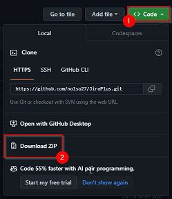
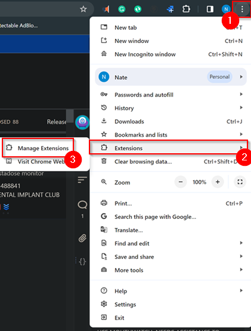
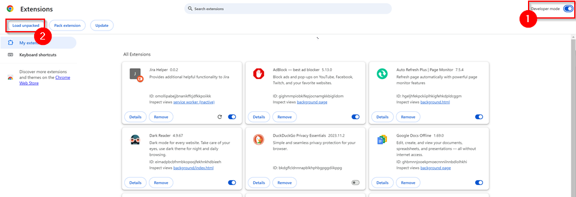

# JiraPlus
## **NOTE:** This was designed for a specific team and does not yet support any Jira projects outside of my own and **only works in Google Chrome**.
Adds additional functionality and ease-of-use to Jira such as a new ticket notifier.

### **Installation**
1. Download the unpacked version of the extension by downloading the zip from Github and then extract it.

3. Open Google Chome and navigate to manage extensions

4. Enable developer mode in the top right
5. Click load unpacked and select the extracted extension folder.

7. It is now installed you can view it in your extensions in the top right of your chrome browser.

